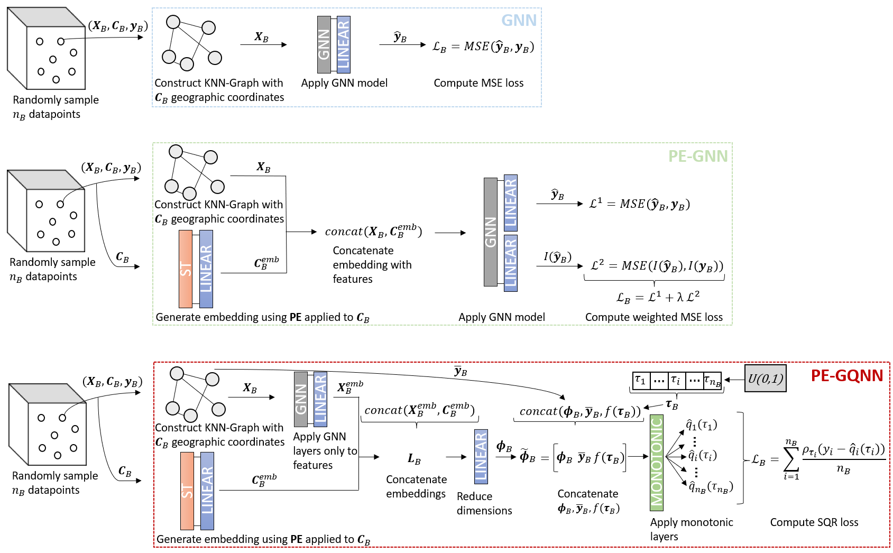

# PyTorch implementation of PE-GQNN

*(Diagram of PE-GQNN. See `images/PEGQNN.png`.)*

This is the official repository for the paper **“Positional Encoder Graph Quantile Neural Networks for Geographic Data”**, published in **Transactions on Machine Learning Research**.

**PE-GQNN** extends **PE-GNN** toward *reliable uncertainty quantification* by learning **conditional quantiles** (and hence full predictive distributions) rather than relying on a Gaussian assumption.

---

## Overview

Positional Encoder Graph Neural Networks (PE-GNNs) are strong models for continuous spatial data, but their predictive distributions can be poorly calibrated.  
PE-GQNN addresses this by combining:
- PE-GNN-style positional encoding with **Quantile Neural Networks**,
- **(partially) monotonic blocks** to support coherent, non-crossing quantile functions,
- and **recalibration-inspired design choices** in a single end-to-end model.

Empirically, PE-GQNN improves both predictive accuracy and uncertainty quantification **without additional computational cost**, and includes **PE-GNN as a special case** of the formulation.

---

## Key architectural ideas (high level)

Algorithmically, PE-GQNN trains by sampling mini-batches, building a kNN graph from geographic coordinates, and predicting **random quantiles** using the SQR-style objective.

Two PE-GQNN distinctions that are useful to know when navigating the code:
1. **GNN layers operate on features only**, and the positional embedding is concatenated *after* the GNN feature embedding.  
2. The model injects (i) a **neighbor-target summary** (mean of neighbors) and (ii) a **random τ ~ U(0,1)** late in the network before the quantile head.

---

## Repository structure

- `data/`  
  Folder to keep interim dataset files.

- `images/`  
  Figures used in the paper (including `images/PEGQNN.png`).

- `notebooks/`  
  Jupyter notebooks to train the models and reproduce the experiments.

- `src/`  
  Core implementation of the PE-GQNN framework and baseline models.

- `trained/`  
  Folder to keep saved models.

---

## Usage (reproducing results)

1. Install dependencies (see `environment.yml`).
2. Open and run the notebooks in `notebooks/` to reproduce experiments.
3. Use the modules in `src/` to modify architectures, losses, and backbones.

Implementation note: the paper implementation uses **PyTorch** and **PyTorch Geometric**.

---
